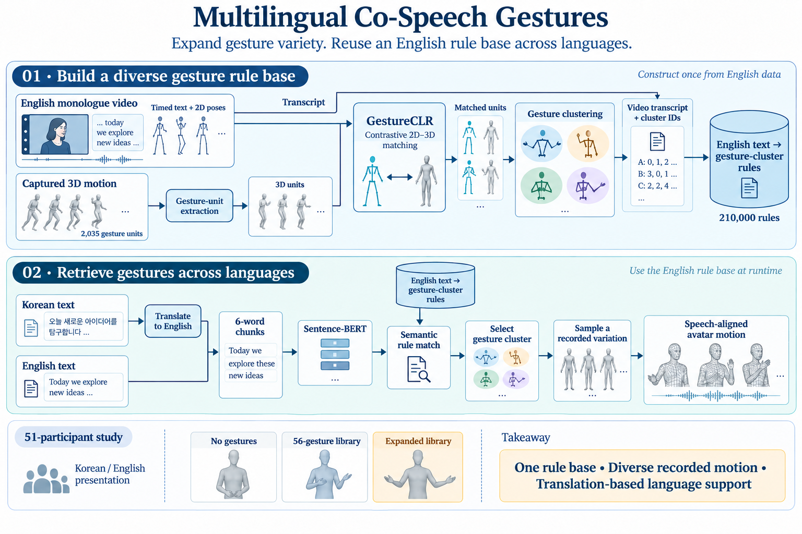

# Expanding Multilingual Co-Speech Interaction: The Impact of Enhanced Gesture Units in Text-to-Gesture Synthesis for Digital Humans

**Ghazanfar Ali, Woojoo Kim, Muhammad Shahid Anwar, Jae-In Hwang, Ahyoung Choi**

**IEEE Access · 2025** · Published

[Paper / publisher](https://doi.org/10.1109/access.2025.3596328) · [Project page](https://ghazanfarali.com/research/multilingual-gesture/) · [BibTeX](citation.bib) · [Requirements](REQUIREMENTS.md) · [Code & setup](#implementation-and-usage)

> More gesture variety supports multilingual digital-human interaction.



*Graphical abstract diagram. GestureCLR expands a clustered gesture library for translation-based multilingual retrieval.*

## Why this research

Digital humans need varied gestures across languages. This study examines both the value of a larger motion library and whether translation can support an English gesture rule base without degrading the studied interaction.

The system extracts text and 2D pose from English monologue videos, matches those poses to captured 3D gesture units with GestureCLR, and builds a text-to-gesture rule base. Non-English input is translated into English before gesture retrieval. The study compares no gestures, a small library, and the expanded library.

## Method at a glance

**Video + captured motion** → **GestureCLR rule-map** → **Text-driven gesture retrieval**

| | Research system |
|---|---|
| Input | Text; non-English text translated into English |
| Method | Contrastive 2D-to-3D matching offline; rule-based retrieval at runtime |
| Output | Retrieved 3D co-speech gesture units for a digital human |

## Evidence and scope

51-participant study of gesture diversity and translation; reported high-noise matching improvement

**Attribution:** These findings describe the paper or manuscript, not results obtained with this repository's code.

**Study context:** English monologue videos; Korean-speaker motion capture; 2,035 units and 210,000 rules.

**Limitations:** Multilingual support uses translation and an English rule base. The study does not establish equivalence across all languages or cultures.

## Explore the implementation

Unit extraction, contrastive pose matching, clustered English rules and translation-first retrieval. Public motion replaces the institute's captured library.

This repository contains independently written research code. The institute's original source, datasets and trained models are not distributed. Public-data preparation, commands, assumptions and checks are documented below and in [REQUIREMENTS.md](REQUIREMENTS.md).

## Resources and citation

Read the paper through its [publisher record](https://doi.org/10.1109/access.2025.3596328). PDFs are hosted by publishers or preprint archives rather than stored in this repository.

Please cite the research paper when using its ideas; [download the BibTeX citation](citation.bib). The implementation has its own documented scope.

## Implementation and usage

<!-- implementation-guide -->

For an immediate browser example after installation, run `python scripts/prepare_viewer.py --out static/vendor` and `python scripts/demo_server.py --example`, then open the printed URL. Enter `결과를 보여 주세요` with language `ko` to see the explicit example translation and clustered motion retrieval. Author-created motion and illustrative vectors are labeled as examples; the prepared-data path below trains and loads GestureCLR.

```bash
python -m pip install -e .
python scripts/prepare_viewer.py --out static/vendor
python scripts/demo_server.py --example
```

Independent educational reimplementation of *Expanding Multilingual Co-Speech Interaction: The Impact of Enhanced Gesture Units in Text-to-Gesture Synthesis for Digital Humans* (Ali et al., IEEE Access 2025, DOI: [10.1109/ACCESS.2025.3596328](https://doi.org/10.1109/ACCESS.2025.3596328)). It follows the paper's actual multilingual design: translate input to English, then run English Sentence-BERT rule retrieval over GestureCLR-matched and clustered motion units. It does not redesign the system as a multilingual encoder.

### Setup and data contract

```bash
python -m venv .venv
source .venv/bin/activate
python -m pip install -e . pytest
```

On Windows PowerShell, activate with `.\.venv\Scripts\Activate.ps1` instead of the `source` line.

Verify the pipeline offline before downloading data or encoders:

```bash
python scripts/verify.py
```

This generates every documented array plus a local 384-D SentenceTransformer fixture, then invokes the installed `extract-units`, `train`, `mine`, and multilingual `retrieve` CLI paths. It writes the result to `outputs/verification/cli-sequence.json`. The local encoder replaces only downloadable Sentence-BERT weights; real public arrays and `all-MiniLM-L6-v2` use the same checkpoints and downstream contracts.

### Prepare data and launch the multilingual demo

`scripts/prepare_public_data.py` converts a licensed BVH plus timed JSONL words to 15 FPS neck-centered paired units, an English `wild.npz` projected-pose proxy and `speaker_motion.npy`. Use at least six seconds and retarget your skeleton to the script's documented joint names. A real wild-video input must replace the proxy with aligned video-estimated 2D pose and English text. Translate non-English queries with your own licensed service and save exact source-text to English-text mappings in `data/translations.json`; the demo refuses untranslated input.

```bash
python scripts/prepare_public_data.py --bvh data/licensed_motion.bvh --transcript data/english_words.jsonl --output-dir data/prepared
multigesture train --pairs data/prepared/pairs.npz --epochs 20 --output checkpoints/gestureclr.pt
multigesture mine --wild data/prepared/wild.npz --units data/prepared/units.npz --checkpoint checkpoints/gestureclr.pt --clusters 10 --output-prefix outputs/library
python scripts/prepare_viewer.py --out static/vendor
python scripts/demo_server.py --data-dir data/prepared --rules outputs/library.rules.jsonl --clusters outputs/library.clusters.npz --translations data/translations.json
```

The browser shows source text, the supplied English translation, six-word rule lookup, cluster choice, similarity and actual BVH-derived joint frames. It never routes non-English text directly into Sentence-BERT. Batch retrieval uses `multigesture retrieve`; `scripts/export_playback.py` joins its sequence to `units.npz`. A short local training run only checks that the paired-projection method learns from the user's data; it does not reproduce the paper's evaluation. `scripts/verify.py` uses random arrays and a local illustrative text encoder.

The [wild pose-matching poster](https://github.com/ghazanPK/wild-pose-matching) introduces this GestureCLR rule-mining path; [RIDGE](https://github.com/ghazanPK/ridge) later uses a GestureCLR-derived motion branch. These are research links, not software imports.

Prepare public data yourself. [Talking With Hands](https://github.com/facebookresearch/TalkingWithHands32M) can provide paired 3D motion for GestureCLR training; [BEAT](https://pantomatrix.github.io/BEAT/) is a public replacement for timed text/motion experiments. Follow each dataset's request process and license. Wild video data must be content you may download/process. No paper data, Korean-speaker capture, Papago credentials, model weights, or reported 2,035-unit/210,000-rule artifact is bundled.

All motion is 15 FPS, root/neck centered, fixed joint order, and flattened as `[N,F,D]`. Training `pairs.npz` has aligned `pose2d` and `motion3d`; `units.npz` has `motion3d` and string `ids`; `wild.npz` has three-second `pose2d` and aligned English `texts`. Translation JSON maps each exact source string to its English translation; generate it with a translation service you are licensed to use.

```bash
multigesture extract-units --motion data/speaker_motion.npy --variance 0.002 --closure 0.3 --output outputs/units.npz
multigesture train --pairs data/pairs.npz --output checkpoints/gestureclr.pt
multigesture mine --wild data/wild.npz --units data/units.npz --checkpoint checkpoints/gestureclr.pt --output-prefix outputs/library --clusters 100
multigesture retrieve --rules outputs/library.rules.jsonl --clusters outputs/library.clusters.npz --source-language ko --translations data/translations.json --text "안녕하세요 여러분" --output outputs/sequence.json
python -m pytest
```

Outputs keep source/English text, semantic similarity, cluster ID, chosen unit ID, and the paper's five-frame blend hint. Tune variance and closure thresholds on a development subset; `100` clusters is a paper setting, not a universal optimum.

### Limits and license

This repository starts after transcription, alignment, projection, and skeleton normalization. It does not call a commercial translation API, perform retargeting, recover the original speech service, or retarget the original avatar. Translation quality, timing, cultural appropriateness, and gesture semantics are separate failure modes; the paper's study does not prove equivalence for all languages. Code is MIT licensed; datasets, pretrained models, translations, and animations keep their original licenses.

### Citation

Machine-readable metadata is in [citation.bib](citation.bib).

```bibtex
@article{ali2025multilingual, title={Expanding Multilingual Co-Speech Interaction: The Impact of Enhanced Gesture Units in Text-to-Gesture Synthesis for Digital Humans}, author={Ali, Ghazanfar and Kim, Woojoo and Anwar, Muhammad Shahid and Hwang, Jae-In and Choi, Ahyoung}, journal={IEEE Access}, volume={13}, pages={145144--145157}, year={2025}, doi={10.1109/ACCESS.2025.3596328}}
```

### Optional local speech adapters

The viewer can speak its query or transcribe user-selected audio. Browser voice and typed text work without model weights. Install `python -m pip install -e ".[speech]"` for local adapters. Obtain Kokoro files from [Kokoro-82M](https://huggingface.co/hexgrad/Kokoro-82M) yourself: `config.json`, `kokoro-v1_0.pth` and `voices/af_heart.pt`. Set `KOKORO_MODEL_DIR` to their parent folder before launching the server. Follow [Kokoro's English phonemizer setup](https://github.com/hexgrad/kokoro), including espeak-ng where required, then choose Local Kokoro. For ASR, set `WHISPER_MODEL_DIR` to a user-downloaded [faster-whisper](https://github.com/SYSTRAN/faster-whisper) small model directory containing `model.bin` and its tokenizer/configuration files. ASR runs on CPU with INT8, requests word timestamps and VAD, and disables implicit model downloads. No speech model files or audio recordings are included in this repo.

<!-- avatar-recorded-motion:start -->
## Bundled characters and recorded public motion

The browser demos include Rowan and Mira, two new fictional GLB characters built with MPFB and MakeHuman community assets under CC0 1.0. See [avatar licensing and provenance](static/avatars/LICENSE.md). Use the character selector in the stage. The shared renderer supports body bones, ARKit facial channels, and approximate speaking motion.

The [recorded BEAT motion companion](static/recorded-motion.html) opens at `/recorded-motion.html` while the demo server is running. It plays locally selected motion, face, and WAV files on the bundled characters; this is recorded public-data inspection, separate from the paper implementation. No BEAT recording, dataset archive, or trained model is bundled. Install the one preparation dependency and fetch a small official sample into ignored `outputs/beat-demo/`:

```sh
python -m pip install numpy
python scripts/beat_demo/fetch_modalities.py --speaker 1 --sequence 1_wayne_0_1_1 --include-bvh --max-bytes 25000000 --output-dir outputs/beat-demo/source
python scripts/beat_demo/prepare_bvh.py --bvh outputs/beat-demo/source/1_wayne_0_1_1.bvh --output outputs/beat-demo/sample/1_wayne_0_1_1-raw-motion.json --frames 120
python scripts/beat_demo/prepare_modalities.py --sequence 1_wayne_0_1_1 --source outputs/beat-demo/source --output outputs/beat-demo/sample --frames 120
```

Open the companion and select `outputs/beat-demo/sample/1_wayne_0_1_1-raw-motion.json`, `1_wayne_0_1_1-face.json`, and `1_wayne_0_1_1.wav`. The downloader caps each original file at 25 MB; the prepared clip contains up to 120 frames. The viewer uses local files and does not upload them. For other BEAT takes, substitute a matching official speaker and sequence ID.

If you already have OmniMo's processed 52-joint Unity humanoid data, use that normalized motion instead:

```sh
python scripts/beat_demo/prepare.py --dataset /path/to/processed/beat --speaker 1 --take 1_wayne_0_1_1 --output outputs/beat-demo/sample/1_wayne_0_1_1-motion.json --max-frames 120
```

Select the resulting `*-motion.json` in the companion. Its metadata carries the humanoid joint mapping and source-to-avatar coordinate conversion. Source FK limb directions constrain the avatar arms; quaternion motion supplies twist. The adapter supports Unity proximal/intermediate/distal finger names. Raw BVH remains a public-data alternative; do not mix the two skeleton conventions.
<!-- avatar-recorded-motion:end -->
