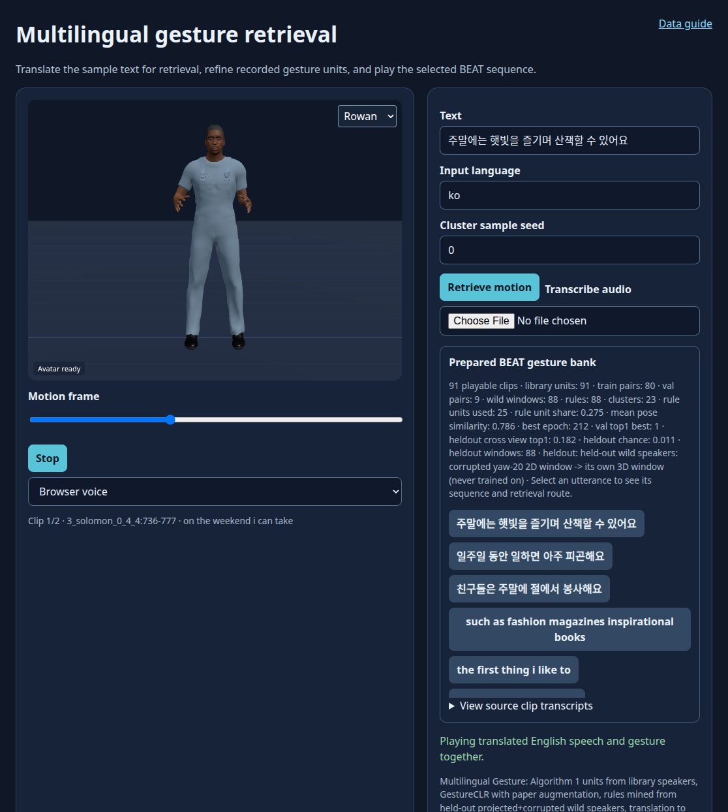

# Expanding Multilingual Co-Speech Interaction: The Impact of Enhanced Gesture Units in Text-to-Gesture Synthesis for Digital Humans

**Ghazanfar Ali, Woojoo Kim, Muhammad Shahid Anwar, Jae-In Hwang, Ahyoung Choi**

**IEEE Access · 2025** · Published

[Paper / publisher](https://doi.org/10.1109/access.2025.3596328) · [Project page](https://ghazanfarali.com/research/multilingual-gesture/) · [BibTeX](citation.bib) · [Requirements](REQUIREMENTS.md) · [Code & setup](#implementation-and-usage)

> More gesture variety supports multilingual digital-human interaction.


*Graphical abstract diagram. GestureCLR expands a clustered gesture library for translation-based multilingual retrieval.*

## Why this research

Digital humans need varied gestures across languages. This study examines both the value of a larger motion library and whether translation can support an English gesture rule base without degrading the studied interaction.

The system extracts text and 2D pose from English monologue videos, matches those poses to captured 3D gesture units with GestureCLR, and builds a text-to-gesture rule base. Non-English input is translated into English before gesture retrieval. The study compares no gestures, a small library, and the expanded library.

## Method at a glance

**Video + captured motion** → **GestureCLR rule-map** → **Text-driven gesture retrieval**

| | Research system |
|---|---|
| Input | Text; non-English text translated into English |
| Method | Contrastive 2D-to-3D matching offline; rule-based retrieval at runtime |
| Output | Retrieved 3D co-speech gesture units for a digital human |

## Evidence and scope

51-participant study of gesture diversity and translation; reported high-noise matching improvement

**Attribution:** These findings describe the paper or manuscript, not results obtained with this repository's code.

**Study context:** English monologue videos; Korean-speaker motion capture; 2,035 units and 210,000 rules.

**Limitations:** Multilingual support uses translation and an English rule base. The study does not establish equivalence across all languages or cultures.

## Explore the implementation

Algorithm 1 unit extraction, contrastive pose matching, clustered English rules and translation-first retrieval through a pluggable translator, with a BEAT route on disjoint speakers. Public motion replaces the institute's captured library.

This repository contains independently written research code. The institute's original source, datasets and trained models are not distributed. Public-data preparation, commands, assumptions and checks are documented below and in [REQUIREMENTS.md](REQUIREMENTS.md).

## Resources and citation

Read the paper through its [publisher record](https://doi.org/10.1109/access.2025.3596328). PDFs are hosted by publishers or preprint archives rather than stored in this repository.

Please cite the research paper when using its ideas; [download the BibTeX citation](citation.bib). The implementation has its own documented scope.

<!-- demo-preview:start -->
## Demo preview



*The prepared BEAT sequence shows local English retrieval with a small Korean translation fixture. This preview is not a paper benchmark.*

From the repository root, using the Python environment described below:

```sh
python -m pip install -e .
python -m pip install -r scripts/requirements-demo.txt
python scripts/start_demo.py
```

Open **http://127.0.0.1:8080/**. First launch downloads one official BEAT BVH and matching TextGrid, prepares nine clips and disjoint paired windows in ignored `outputs/`, extracts Algorithm 1 units of roughly 2–2.5 seconds, and fits the small GestureCLR pose matcher locally. Non-English input passes through a `Translator` (by default an explicit dictionary fixture covering three Korean example utterances) before English retrieval; English examples run directly. Text matching uses Sentence-BERT when `BEAT_SBERT_MODEL` names a local model folder and a TF-IDF fallback otherwise; each response names its text encoder, and text without a match plays an explicit idle slot. Choose an example to inspect the translation and selected sequence, then click **Play speech + gesture**. Stop cancels speech, and scrubbing previews a pose. The first launch also downloads pinned Three.js modules. Public recordings and fitted weights remain local.

The 3D presentation uses shared Three.js avatar components and bundled fictional CC0 characters. The paper-specific algorithms and data adapters live in this repository.

**Paper method on BEAT.** When a BEAT source is configured (`BEAT_PROCESSED_ROOT` for a processed collection, `BEAT_RAW_ROOT` for raw `beat_english_v0.2.1` BVH/TextGrid, or a copy under `data/beat/`) and a local Sentence-BERT folder exists (`SBERT_MODEL`, or `models/all-MiniLM-L6-v2`), `scripts/start_demo.py` first runs `scripts/prepare_paper_method.py`, which trains or mines with this repository's own pipeline on disjoint BEAT speakers and caches the result under ignored `outputs/paper-method/`. The same viewer then serves that prepared method with its library and suggested queries. Without the data the launcher serves the small demo adapter above; `--skip-paper-method` forces it. See [Reproduce with BEAT](#reproduce-with-beat).

To replace the demo motion with an existing processed BEAT take, run `python scripts/prepare_beat_demo.py --processed /path/to/processed/beat`, then restart the server. Use `--rebuild --epochs 80` to regenerate the public sample and refit the small adapter. For a larger bank, the documented full-data CLI below retains the paper-specific input contracts.

<!-- demo-preview:end -->

## Implementation and usage

<!-- implementation-guide -->

The default browser path is the prepared BEAT demo above. The older `python scripts/demo_server.py --example` path, when the prepared BEAT cache is absent, remains an offline fixture with author-created motion, illustrative vectors, and an explicit Korean translation. The prepared-data commands below retain the full training and retrieval contracts.

```bash
python -m pip install -e .
python scripts/prepare_viewer.py --out static/vendor
python scripts/demo_server.py --example
```

Independent educational reimplementation of *Expanding Multilingual Co-Speech Interaction: The Impact of Enhanced Gesture Units in Text-to-Gesture Synthesis for Digital Humans* (Ali et al., IEEE Access 2025, DOI: [10.1109/ACCESS.2025.3596328](https://doi.org/10.1109/ACCESS.2025.3596328)). It follows the paper's actual multilingual design: translate input to English, then run English Sentence-BERT rule retrieval over GestureCLR-matched and clustered motion units. It does not redesign the system as a multilingual encoder. Its matching lineage follows [Wild Pose Matching](https://github.com/ghazanPK/wild-pose-matching); [RIDGE](https://github.com/ghazanPK/ridge) later adds strong-rule and learned fallback routing.

### Reproduce with BEAT

`scripts/prepare_paper_method.py` runs this repository's full pipeline on public [BEAT](https://pantomatrix.github.io/BEAT/) motion, then serves the result in the browser viewer. Disjoint speakers take the paper's three roles:

| Role | Default speakers | Used for |
|---|---|---|
| `library` | 2 | Continuous 3D motion → Algorithm 1 units (`multigesture extract-units --variance auto`) |
| `train` | 2 | 3 s windows: clean 3D plus a 2D projection at a random yaw within ±30° → GestureCLR with the paper's augmentation (`multigesture train`) |
| `wild` | 2 | Held-out 3 s windows with their English transcripts → unit matching, Bisecting K-Means and the English rule map (`multigesture mine`). The windows are projected through a camera at yaw 20° and pitch 5°, then corrupted like OpenPose tracks: noise, ±1-frame jitter and 5% joint dropout. |

Roles are assigned per speaker with a fixed `--seed`. `--role library=1,2 --role train=0.5 --role wild=rest` overrides them.

**1. Sentence-BERT, once.** The hook never downloads a model. Save `all-MiniLM-L6-v2` locally (about 90 MB):

```bash
python -c "from sentence_transformers import SentenceTransformer; SentenceTransformer('all-MiniLM-L6-v2').save('models/all-MiniLM-L6-v2')"
```

`--sbert DIR` or the `SBERT_MODEL` environment variable selects another local copy.

**2a. Processed OmniMo collection.** The collection is laid out as `<root>/<speaker>/{meta.json,motion.npz}`:

```bash
python scripts/prepare_paper_method.py --processed /path/to/processed/beat
python scripts/demo_server.py --prepared outputs/paper-method/<key> --port 8080
```

The last line of standard output is JSON whose `server_args` give the exact prepared folder.

**2b. Raw BEAT from Hugging Face.** Download BVH and TextGrid pairs from the official dataset [`H-Liu1997/BEAT`](https://huggingface.co/datasets/H-Liu1997/BEAT) into `data/beat/beat_english_v0.2.1/<speaker>/`. Each BVH is about 20 MB:

```bash
base=https://huggingface.co/datasets/H-Liu1997/BEAT/resolve/main/beat_english_v0.2.1/beat_english_v0.2.1
for take in 1_wayne_0_1_1 1_wayne_0_2_2 2_scott_0_1_1 2_scott_0_2_2 3_solomon_0_3_3 3_solomon_0_4_4 \
            4_lawrence_0_2_2 4_lawrence_0_3_3 5_stewart_0_1_1 5_stewart_0_2_2 6_carla_0_2_2 6_carla_0_3_3; do
  spk=${take%%_*}; mkdir -p data/beat/beat_english_v0.2.1/$spk
  for ext in bvh TextGrid; do curl -fL -o data/beat/beat_english_v0.2.1/$spk/$take.$ext $base/$spk/$take.$ext; done
done
python scripts/prepare_paper_method.py --beat-root data/beat/beat_english_v0.2.1
```

**3. Translation.** The prepared server translates non-English input before retrieval, as the paper does. By default it uses the exact-text map in `examples/beat-translations.json`, whose Korean examples appear as suggested queries. For free text, start the server with one of the [translators](#translation), for example `python scripts/demo_server.py --prepared outputs/paper-method/<key> --translator local --mt-model-path models/opus-mt-ko-en`.

**Launcher.** `python scripts/start_demo.py` runs this hook after the shared BEAT demo preparation.
- **Source.** It looks in `--processed` or `--beat-root`, then `BEAT_PROCESSED_ROOT` or `BEAT_RAW_ROOT`, then `data/beat/processed` or `data/beat/beat_english_v0.2.1`.
- **Missing input.** Without a source or Sentence-BERT, it prints the next step and the default demo starts unchanged.
- **Cache.** Results are cached in ignored `outputs/paper-method/<settings hash>/`. A repeat launch with the same settings returns at once; `--force` rebuilds.

**Demo scale and paper preset.**
- **Demo (default).** Speakers 1–6, two takes each, `--preset demo`: 300 epochs at batch 64, and about one cluster per four units. On a CPU it takes two to three minutes. One local run on the processed collection gave 91 units, 80 training pairs, 88 English rules over 23 clusters, and a held-out cross-view top-1 of 0.18 against a chance of 0.011 (88 windows).
- **Paper preset.** `--speakers all --max-takes-per-speaker 0 --preset paper` trains 1000 epochs at batch 512 with 100 clusters.
- **Tuning.** `--epochs`, `--clusters` and `--variance` adjust either.

**Viewer.** `/api/beat-library` lists the library units and the stored metrics. Its suggested queries include the Korean examples, English rule phrases and held-out probes; the probes are library-speaker transcripts that never became rules. `/api/beat-query` returns the source, English and TTS text, and for each six-word chunk the unit frames, cluster, route and score. The route is `learned_pose_rule`, or `idle_no_match` below the 0.2 similarity floor (`min_similarity`).

**Limits.** Projected BEAT motion stands in for wild video and OpenPose output; it is not the paper's data, and BEAT speech is English, so the Korean path is translation followed by English retrieval only. The held-out metric checks whether a corrupted 2D window finds its own 3D window among the held-out windows; it is not a paper benchmark.

### Setup and data contract

```bash
python -m venv .venv
source .venv/bin/activate
python -m pip install -e . pytest
```

On Windows PowerShell, activate with `.\.venv\Scripts\Activate.ps1` instead of the `source` line.

Verify the pipeline offline before downloading data or encoders:

```bash
python scripts/verify.py
```

This generates every documented array plus a local 384-D SentenceTransformer fixture, then invokes the installed `extract-units`, `train`, `mine`, and multilingual `retrieve` CLI paths. It writes the result to `outputs/verification/cli-sequence.json`. The local encoder replaces only downloadable Sentence-BERT weights; real public arrays and `all-MiniLM-L6-v2` use the same checkpoints and downstream contracts.

### Prepare data and launch the multilingual demo

`scripts/prepare_public_data.py` converts one licensed BVH take plus timed JSONL words or a BEAT TextGrid to 15 FPS neck-centered data:
- `units.npz`: library units from Algorithm 1 over the continuous take, with true `lengths`;
- `pairs.npz`: 3-second paired 2D/3D windows for GestureCLR training;
- `wild.npz`: an English projected-pose proxy;
- `speaker_motion.npy`: the continuous take.

IDs are `<take>:<start>-<end>`, and every row stores `speakers`. Run the script once per take; `train`, `mine` and the demo accept several output files. Use at least six seconds of motion and retarget your skeleton to the script's documented joint names. The proxy comes from the same take, so for meaningful mining replace it with held-out speakers or aligned video-estimated 2D pose with English text.

```bash
python scripts/prepare_public_data.py --bvh data/1_wayne_0_1_1.bvh --transcript data/1_wayne_0_1_1.TextGrid --speaker wayne --output-dir data/prepared/1_wayne_0_1_1
multigesture train --pairs data/prepared/*/pairs.npz --preset demo --output checkpoints/gestureclr.pt
multigesture mine --wild data/prepared/*/wild.npz --units data/prepared/*/units.npz --checkpoint checkpoints/gestureclr.pt --clusters 10 --output-prefix outputs/library
python scripts/prepare_viewer.py --out static/vendor
python scripts/demo_server.py --data-dir data/prepared/1_wayne_0_1_1 --units data/prepared/*/units.npz --rules outputs/library.rules.jsonl --clusters outputs/library.clusters.npz --translations data/translations.json --min-similarity 0.3
```

The browser shows:
- the source text and its English translation;
- the six-word rule lookup, cluster choice and similarity;
- idle slots below the similarity floor;
- the actual BVH-derived joint frames, trimmed to each unit's true length.

Non-English text is never routed directly into Sentence-BERT. Prepared mode imports this repository's `src/` package, not the vendored stand-in copy. Batch retrieval uses `multigesture retrieve`; `scripts/export_playback.py` joins its sequence to `units.npz`, honouring unit `lengths` and each slot's `blend_frames`. A short local training run only checks that the paired-projection method learns from the user's data; it does not reproduce the paper's evaluation. `scripts/verify.py` uses random arrays and a local illustrative text encoder.

### Translation

`--translator` selects the client that implements the `Translator` protocol in `src/multilingual_gesture/translate.py`. The paper used Naver Papago; any of these can stand in for it:

| `--translator` | Behaviour |
|---|---|
| `dict` (default) | Exact source-text → English map from `--translations` JSON. Unlisted text fails. |
| `http` | `--translator-url` endpoint. `--translator-api openai` (default) posts a chat completion with `--translator-model`; `--translator-api libretranslate` posts `{q, source, target}`. A key is read from the variable named by `--translator-api-key-env`, if set. |
| `local` | `--mt-model-path` points to a user-downloaded Hugging Face MT model directory, for example `opus-mt-ko-en`, or to a JSON map such as `{"ko->en": dir}`. Requires `transformers`. Files are loaded with `local_files_only`. |

Retrieval output carries `english_text` for gesture lookup, `tts_text` (the source chunk, or its translation when `--tts-language` differs) for speech, and per-gesture English and TTS word spans.

The [wild pose-matching poster](https://github.com/ghazanPK/wild-pose-matching) introduces this GestureCLR rule-mining path; [RIDGE](https://github.com/ghazanPK/ridge) later uses a GestureCLR-derived motion branch. These are research links, not software imports.

Prepare public data yourself. [Talking With Hands](https://github.com/facebookresearch/TalkingWithHands32M) can provide paired 3D motion for GestureCLR training; [BEAT](https://pantomatrix.github.io/BEAT/) is a public replacement for timed text/motion experiments. Follow each dataset's request process and license. Wild video data must be content you may download/process. No paper data, Korean-speaker capture, Papago credentials, model weights, or reported 2,035-unit/210,000-rule artifact is bundled.

All motion is 15 FPS, root/neck centered, fixed joint order, and flattened as `[N,F,D]`:
- Training `pairs.npz` has aligned `pose2d` and `motion3d`.
- `units.npz` has `motion3d` and string `ids`.
- `wild.npz` has three-second `pose2d` and aligned English `texts`.
- Optional `lengths` (valid frames) and `speakers` arrays are honoured everywhere. Padded frames are masked in the encoders during training and mining.

Every array argument takes several files or a manifest: a `.json` list of paths or `{"path", "speaker", "take"}` objects, or a `.txt` list. `--speaker`, `--unit-speaker` and `--wild-speaker` filter by speaker. Translation JSON maps each exact source string to its English translation; generate it with a translation service you are licensed to use.

```bash
multigesture extract-units --motion data/take_a.npy data/take_b.npy --variance auto --output outputs/units.npz
multigesture train --pairs data/pairs.npz --preset paper --output checkpoints/gestureclr.pt --history outputs/train-history.json
multigesture mine --wild data/wild.npz --units outputs/units.npz --checkpoint checkpoints/gestureclr.pt --output-prefix outputs/library --clusters 100
multigesture retrieve --rules outputs/library.rules.jsonl --clusters outputs/library.clusters.npz --source-language ko --translations data/translations.json --text "안녕하세요 여러분" --min-similarity 0.3 --idle-id idle --audio-seconds 2.4 --output outputs/sequence.json
python -m pytest
```

**Algorithm 1** (`extract-units`) scores every 2–3 s clip by its start/end pose distance. Clips are taken in order of minimal distance and removed from the sequence. Each becomes a unit if its variance passes the threshold. Closure and variance are measured after dividing by the take's body scale, so thresholds are unit-free: the same values work for centimetre BEAT data and metre-scale data.
- `--variance auto` replaces the paper's hand-picked elbow with the elbow of the sorted log-variance curve.
- `--variance 0.002 --closure 0.3` are fixed alternatives.
- On the public BEAT take `1_wayne_0_1_1`, both settings yield about 20 units from 69 s.

**Training** follows the paper: AdamW, lr 5×10⁻⁴, weight decay 10⁻⁴, cosine annealing and NT-Xent.
- Each 2D sample draws one condition: clean; Gaussian noise with variance 0.001, 0.01 or 0.1 (standard deviation √variance, on scale-normalised poses); or the 30-in-45 temporal shift with mean fill or zero fill. The shift takes a random 30-frame source segment and places it at offset 1–15.
- `--augment` can add the combined `noise_shift` condition.
- A validation split (`--val-fraction`) reports loss and top-1 matching. The best validation checkpoint is kept.
- `--preset paper` uses 1000 epochs at batch 512. `--preset demo` (the default) uses 300 epochs at batch 64; it reaches validation top-1 of 1.0 on the single public BEAT take.

**Retrieval** runs the steps below. Outputs keep the source, English and TTS text, semantic similarity, cluster ID, chosen unit ID and the paper's five-frame blend hint.
1. Input over 30 words is split into sentence chunks.
2. Each chunk is translated and cut into six-word pieces.
3. A unit is drawn at random from the best-matching cluster. Below `--min-similarity`, `--idle-id` plays instead.
4. Durations are paced from `--audio-seconds`, then refined from `--word-timestamps` when the TTS engine supplies them.

`100` clusters is a paper setting, not a universal optimum.

### Limits and license

This repository starts after transcription, alignment, projection, and skeleton normalization. It bundles no translation credentials or MT weights; the HTTP and local translator clients use services or models you configure. It does not perform retargeting, recover the original speech service, or retarget the original avatar. Translation quality, timing, cultural appropriateness, and gesture semantics are separate failure modes; the paper's study does not prove equivalence for all languages. Code is MIT licensed; datasets, pretrained models, translations, and animations keep their original licenses.

### Citation

Machine-readable metadata is in [citation.bib](citation.bib).

```bibtex
@article{ali2025multilingual, title={Expanding Multilingual Co-Speech Interaction: The Impact of Enhanced Gesture Units in Text-to-Gesture Synthesis for Digital Humans}, author={Ali, Ghazanfar and Kim, Woojoo and Anwar, Muhammad Shahid and Hwang, Jae-In and Choi, Ahyoung}, journal={IEEE Access}, volume={13}, pages={145144--145157}, year={2025}, doi={10.1109/ACCESS.2025.3596328}}
```

### Optional local speech adapters

The viewer can speak its query or transcribe user-selected audio. Browser voice and typed text work without model weights. Install `python -m pip install -e ".[speech]"` for local adapters. Obtain Kokoro files from [Kokoro-82M](https://huggingface.co/hexgrad/Kokoro-82M) yourself: `config.json`, `kokoro-v1_0.pth` and `voices/af_heart.pt`. Set `KOKORO_MODEL_DIR` to their parent folder before launching the server. Follow [Kokoro's English phonemizer setup](https://github.com/hexgrad/kokoro), including espeak-ng where required, then choose Local Kokoro. For ASR, set `WHISPER_MODEL_DIR` to a user-downloaded [faster-whisper](https://github.com/SYSTRAN/faster-whisper) small model directory containing `model.bin` and its tokenizer/configuration files. ASR runs on CPU with INT8, requests word timestamps and VAD, and disables implicit model downloads. No speech model files or audio recordings are included in this repo.

<!-- avatar-recorded-motion:start -->
## Bundled characters and recorded public motion

The browser demos include Rowan and Mira, two new fictional GLB characters built with MPFB and MakeHuman community assets under CC0 1.0. See [avatar licensing and provenance](static/avatars/LICENSE.md). Use the character selector in the stage. The shared renderer supports body bones, ARKit facial channels, and approximate speaking motion.

Recorded motion is adapted to the characters' proportions. Palm landmarks set hand orientation; finger curl uses bounded hinge bends and preserves the character's finger spacing. Thumb-base opposition stays in the authored pose, with conservative recorded curl at the remaining joints. Distal bends are estimated from the preceding joint when fingertip landmarks are absent. Use the companion's hand close-up views to inspect the result.

The [avatar motion companion](static/recorded-motion.html) opens at `/recorded-motion.html` while the demo server is running. A small authored motion and face sample loads automatically; click **Play** without uploading files. It also plays locally selected BEAT motion, face, and WAV files on the bundled characters. These are presentation and data-inspection tools, separate from the paper implementation. No BEAT recording, dataset archive, or trained model is bundled. For recorded public motion, install the one preparation dependency and fetch a small official sample into ignored `outputs/beat-demo/`:

```sh
python -m pip install numpy
python scripts/beat_demo/fetch_modalities.py --speaker 1 --sequence 1_wayne_0_1_1 --include-bvh --max-bytes 25000000 --output-dir outputs/beat-demo/source
python scripts/beat_demo/prepare_bvh.py --bvh outputs/beat-demo/source/1_wayne_0_1_1.bvh --output outputs/beat-demo/sample/1_wayne_0_1_1-raw-motion.json --frames 120
python scripts/beat_demo/prepare_modalities.py --sequence 1_wayne_0_1_1 --source outputs/beat-demo/source --output outputs/beat-demo/sample --frames 120
```

Open the companion and select `outputs/beat-demo/sample/1_wayne_0_1_1-raw-motion.json`, `1_wayne_0_1_1-face.json`, and `1_wayne_0_1_1.wav`. The downloader caps each original file at 25 MB; the prepared clip contains up to 120 frames. The viewer uses local files and does not upload them. For other BEAT takes, substitute a matching official speaker and sequence ID.

If you already have OmniMo's processed 52-joint Unity humanoid data, use that normalized motion instead:

```sh
python scripts/beat_demo/prepare.py --dataset /path/to/processed/beat --speaker 1 --take 1_wayne_0_1_1 --output outputs/beat-demo/sample/1_wayne_0_1_1-motion.json --max-frames 120
```

Select the resulting `*-motion.json` in the companion. Its metadata carries the humanoid joint mapping and source-to-avatar coordinate conversion. The viewer fits source FK directions from the avatar's bind pose, following the spine explicitly at branching joints. This avoids applying incompatible source bone twist to the MPFB skin; it does not reproduce exact performer twist. The adapter supports Unity proximal/intermediate/distal finger names. Raw BVH remains a public-data alternative; do not mix the two skeleton conventions.
<!-- avatar-recorded-motion:end -->
